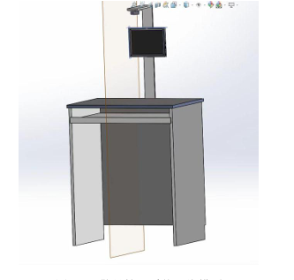
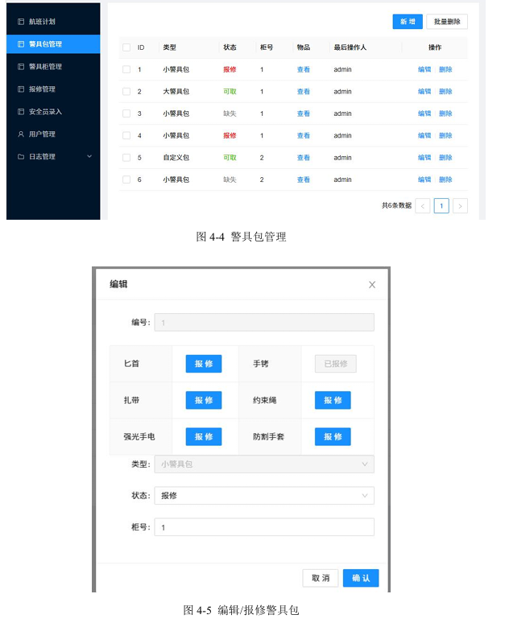
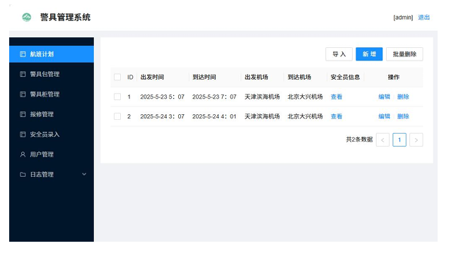
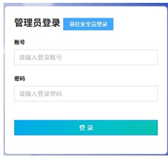
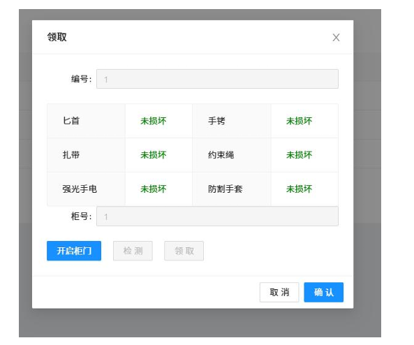

# 机场管理系统

## 项目介绍

这是一个基于Django和Vue 3的机场管理系统，包含后端API和前端界面，实现了机场相关的多种管理功能。

## 技术栈

### 后端
- **框架**：Django 3.2.11
- **API框架**：Django REST Framework 3.13.0
- **数据库**：MySQL (PyMySQL)
- **图像处理**：Pillow 9.1.1
- **系统监控**：psutil 5.9.4
- **计算机视觉**：PyTorch (torchvision 0.21.0)、Ultralytics 8.3.108
- **安全**：pyOpenSSL 23.2.0

### 前端
- **框架**：Vue 3.2.45
- **构建工具**：Vite 4.0.3
- **UI组件库**：Ant Design Vue 3.2.20
- **状态管理**：Pinia 2.0.28
- **路由**：Vue Router 4.1.6
- **HTTP客户端**：Axios 1.2.2
- **工具库**：@vueuse/core 9.10.0
- **样式**：Less 4.1.3

## 项目结构

```
├── server/            # 后端Django项目
│   ├── myapp/         # 主应用
│   │   ├── auth/      # 认证相关
│   │   ├── middlewares/ # 中间件
│   │   ├── models/    # 数据模型
│   │   ├── permission/ # 权限管理
│   │   ├── views/     # 视图
│   ├── server/        # 项目配置
│   ├── manage.py      # 管理脚本
│   └── requirements.txt # 依赖文件
├── web/               # 前端Vue项目
│   ├── public/        # 静态资源
│   ├── src/           # 源代码
│   │   ├── api/       # API调用
│   │   ├── assets/    # 静态资源
│   │   ├── router/    # 路由
│   │   ├── store/     # 状态管理
│   │   ├── utils/     # 工具函数
│   │   └── views/     # 页面组件
│   └── package.json   # 依赖配置
└── airport.sql        # 数据库初始化脚本
```

## 功能模块

### 1. 用户管理
- 用户注册、登录
- 用户信息管理
- 权限控制

### 2. 警具管理
- 警具信息录入
- 警具状态管理
- 警具借用与归还

### 3. 警具柜管理
- 警具柜信息管理
- 警具柜状态监控

### 4. 航空公司管理
- 航空公司信息维护
- 航班信息管理

### 5. 调度管理
- 人员调度
- 任务分配

### 6. 告警管理
- 告警信息录入
- 告警处理跟踪

### 7. 日志管理
- 操作日志
- 登录日志
- 错误日志

## 快速开始

### 后端部署

1. 安装依赖
```bash
cd server
pip install -r requirements.txt
```

2. 配置数据库
修改 `server/settings.py` 中的数据库配置

3. 初始化数据库
```bash
python manage.py migrate
```

4. 启动服务器
```bash
python manage.py runserver
```

### 前端部署

1. 安装依赖
```bash
cd web
npm install
```

2. 开发模式运行
```bash
npm run dev
```

3. 生产环境构建
```bash
npm run build
```

## 系统截图

### 登录界面


### 主界面


### 硬件模型



### 警具包管理



### 航空计划



### 登录界面



### 获取警局



## 计算机视觉功能

系统集成了基于Ultralytics YOLO的目标检测功能，可用于：
- 机场安全监控
- 人员识别
- 物品检测


